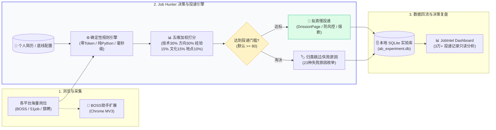

# Job Hunter — AI 辅助的求职投递工作流

> 与其广撒网，不如精准慢投：让 AI 读你的简历，只投匹配的岗位，并记录每一步的成败。

<p align="center">
  <b>🌐 AI 智能求职全链路套件 (Job Intelligence Suite)</b><br>
  <a href="https://github.com/Liooo0/boss-zhipin-helper">🧩 浏览器扩展 (JD即时提炼/AI回复)</a>
  &nbsp;•&nbsp;
  <b>🎯 Job Hunter (规则引擎/精准拟真投递)</b>
  &nbsp;•&nbsp;
  <a href="https://github.com/Liooo0/jobintel-dashboard">📊 决策仪表盘 (3万+投递数据复盘)</a>
</p>

<p align="center">
  
  
  
  
  
</p>

这是一个 [Claude Code](https://claude.com/claude-code) 的 **skill**：读取简历、记住求职方向与底线，在招聘平台上完成「JD 解析 → 规则过滤 → 匹配打分 → 投递 → 失败追踪 → 数据复盘」的闭环。

**设计原则：自动化提质，不追求量。** 匹配交给确定性的规则引擎，决策权始终在你手里。

## 30 秒看懂这个仓库

| 问题 | 回答 |
|------|------|
| 这是干什么的？ | 本地跑的求职工作流：按你的简历和底线给每个 JD 打分排序，只投达标的岗位，每次投递的五维评估结论落库可复盘 |
| 它和"群发爬虫"差在哪？ | ① 打分是**纯 Python 规则引擎，不走 LLM、0 token**，同一个 JD 昨天今天分数一致，每个分数都能解释到具体命中词；② 投递节奏贴近人工、带熔断和急停开关；③ 拒绝/已读不回等失败原因结构化入库，用来反哺筛选规则 |
| 谁做决定？ | 规则层只决定"够不够格"，投不投、聊什么、接不接 offer 都是人 |
| 靠谱吗？ | 作者自用跑过 **6,100+ 真实投递、34,000+ 条规则过滤、覆盖 2,700+ 家公司**（截至 2026-08 本机 SQLite 统计；本仓库不含任何个人投递数据） |

## 全链路工作流



- **JD 解析**：结构化解出岗位与关键词，评估依据可解释
- **资格层三层过滤**（决定能不能投）：关键词打分 → 智能/薪资过滤 → 标题党与公司背调检测
- **五维匹配报告**（决定值不值得投）：技术 30% / 职业方向 30% / 经验 15% / 文化 15% / 地点 10%，输出总分 + 结论分档 + 命中/缺口/风险解释卡
- **失败追踪**：9 个阶段 × 23 种失败原因枚举入库，支持多版简历对比实验
- **数据复盘**：全部记录进 SQLite，由 [jobintel-dashboard](https://github.com/Liooo0/jobintel-dashboard) 只读可视化

## 快速开始

### 第 0 步：不用装任何东西，先玩评分引擎

评分引擎是零依赖纯标准库，没有浏览器、没有 config.json 也能跑：

```bash
git clone https://github.com/Liooo0/job-hunter.git && cd job-hunter

# 纯 Python 3 标准库直接运行（零三方依赖）：
python3 match_engine.py "AI应用工程师" \
  --desc "负责RAG知识库与Agent工作流开发，Python/FastAPI" \
  --salary "15-25K" --city 深圳

# 或使用 uv 单命令免配环境运行：
uv run match_engine.py "AI应用工程师" \
  --desc "负责RAG知识库与Agent工作流开发，Python/FastAPI" \
  --salary "15-25K" --city 深圳
```

输出：

```
┌─ 岗位匹配报告 ──────────────────────────────────
│ 总分: 88/100 → 🚀 强烈推荐 (strong_apply)
├─ 五维明细 ───────────────────────────────────
│ 技术匹配 ██████████ 100 ×30% →  30.0   技能命中: RAG/Agent/知识库/工作流...
│ 职业方向 █████████░  90 ×30% →  27.0   S级方向: AI应用工程师
│ 经验匹配 ███████░░░  70 ×15% →  10.5   无明显经验表述
│ 文化匹配 ███████░░░  75 ×15% →  11.2   无文化风险/加分信号(默认75)
│ 地点通勤 █████████░  90 ×10% →   9.0   深圳=primary城市
├─ 技能命中: RAG、Agent、知识库、工作流、Python、FastAPI
└─ 备注: target_roles 缺失，已从 job_pools.keywords 兜底映射 | 关键词层得分=40
```

加 `--json` 得机器可读输出，`--desc-file jd.txt` 读长 JD。

### 完整安装（自动投递）

```bash
# 1. 放进 Claude Code skills 目录
git clone https://github.com/Liooo0/job-hunter.git ~/.claude/skills/job-hunter

# 2. 装浏览器控制依赖（评分引擎不需要，自动投递需要）
pip install DrissionPage httpx

# 3. 启动带调试端口的 Chrome 并登录招聘平台（macOS 示例）
#    端口与 user-data-dir 要和脚本一致：三个平台脚本都用 9223 + ~/job-hunter-chrome
/Applications/Google\ Chrome.app/Contents/MacOS/Google\ Chrome \
  --remote-debugging-port=9223 --user-data-dir="$HOME/job-hunter-chrome"

# 4. （可选）生成自己的配置——不做这步也开箱即用，内置了兜底词表/薪资线/岗位池
cp config.example.json config.json
```

在 Claude Code 里说一句 `帮我投简历` 即可；也可以直接手动跑：

```bash
cd ~/.claude/skills/job-hunter
PYTHONPATH="" python3 boss_apply.py --cities "深圳,广州" --jobs "AI应用工程师,AI实施" --count 20
```

> 💡 手动跑显示「夜间禁投」是正常的风控保护（默认 23:00-08:00 不投递），白天再试即可。
> 想验证整套规则而不碰浏览器，可以跑测试（纯标准库，无需安装任何东西）：
>
> ```bash
> python3 tests/regression.py          # 25 个真实 JD 回归案例
> PYTHONPATH="" python3 -m unittest discover -s tests -p "test_*.py" -t .   # 468 个单元测试
> ```

## 配置说明

`config.json` 缺失时程序用内置兜底配置运行；想要个性化，改这些键：

| 字段 | 作用 |
|------|------|
| `skills` | 你的技能词 → JD 每命中一个 +5 分，封顶 +30 |
| `target_roles` | 期望岗位 → 标题命中 +30 分（缺省时从 job_pools 兜底映射） |
| `exclude_keywords` | 排除词 → 标题命中直接归零 |
| `body_exclude_keywords` | 正文排除词 → 大小周/996/销售动作词等命中归零 |
| `boost_keywords` | 加权词 → JD 命中 +10 |
| `job_pools.keywords` | S/A/B 三级岗位方向词组 → 五维「职业方向」的分档依据 |
| `salary_filter` | 城市 × 最低月薪线（home/away 两档） |
| `city_pools.city_priority` | primary / secondary / opportunistic 三档城市 |
| `min_score` | 最低投递分数线 |
| `safety` | 日上限 / 单小时上限 / 夜间禁投窗口 / 去重天数 |

完整示例见 [`config.example.json`](config.example.json)，每个块都有一行 `_说明`。

## 岗位评估框架（已自动化）

五维加权源自 [ai-job-search](https://github.com/MadsLorentzen/ai-job-search) 的 job-evaluation 体系，针对国内求职场景调整权重，并由 `match_engine.py` 在每次投递前自动执行：

| 维度 | 权重 | 怎么算 |
|------|:---:|--------|
| 技术匹配 | 30% | 技能词命中数（ASCII 词边界正则，"AI" 不会误命中 "Maintained"）+ 加分词；传统栈无 AI 保护词扣分 |
| 职业方向 | 30% | 标题对照 S/A/B 级岗位池分档 |
| 经验匹配 | 15% | 年限门槛词分档（应届友好 85 / 无表述 70 / 高级资深 20） |
| 文化匹配 | 15% | 外包名单 −15 · 作息风险词 −30 · 高价值项目 +10 |
| 地点通勤 | 10% | primary 城 90 / secondary 70 / opportunistic 55 / 远程 95 |

| 总分 | 结论 |
|:---:|------|
| ≥75 | 🚀 强烈推荐 |
| 60-74 | ✅ 可以投 |
| 45-59 | 🤔 斟酌 |
| <45 | 🛑 跳过 |

结论随投递记录一起写入 SQLite（reason 字段含 `五维XX分:verdict`），事后可以按维度复盘哪类岗位值得投。

## 工程细节（为什么值得看代码）

- **单一事实源**：投递/跳过/失败全部写 SQLite（`store.py`），启动自动迁移旧 JSON 日志，报告/跟进/A-B 统计同源不同口径的数字打架问题不存在
- **投递验证状态机**：点击"立即沟通"后验证会话真实打开、消息真实发出，结果分为 `APPLIED` / `UNCERTAIN`（需人工复核）/ `FAILED`，杜绝"假发送"
- **风控防护**：kill switch 全局急停、跨进程日/小时双熔断、夜间禁投、公司去重——这是被平台封号两次换来的教训清单
- **确定性优先**：所有打分/过滤都是本地规则，LLM 只用于可选的 HR 消息草拟；同一输入永远同一输出
- **回归测试**：25 个真实 JD 案例回归集 + 468 个单元测试，GitHub Actions 每次 push 跑语法检查

## Token 消耗预估

| 阶段 | Tokens |
|------|--------|
| 首次引导（读简历 + 抽技能 + 生成话术） | ~6K |
| 每次启动投递（读 config + 运行脚本 + 汇报） | ~3K |
| 本地评分匹配与五维报告 | **0**（纯 Python，不走 LLM） |

投 100 个岗位的总成本 ≈ 读简历一次（一次性）+ 3K 启动，**不随岗位数线性增长**。

## 平台支持

| 平台 | 投递方式 | 城市 | 前置要求 |
|------|---------|------|---------|
| Boss 直聘 | "立即沟通" | 21 个（含「全国」） | 登录 |
| 猎聘 | 详情页「投简历」`A.btn-minor` | 12 个 | 登录 |
| 前程无忧 51job | 搜索页内联"投递"按钮 | 16 个 | 登录 + 完善 51job 在线简历 |

城市码表在各脚本里（`shared.CITY_CODES` / `platform_51job.CITY_CODES` /
`platform_liepin.CITY_CODES`），**不要照抄别的平台**。2026-09-20 实查：三平台都
**没有**中山；Boss / 猎聘**没有**惠州；广东省内覆盖率最高的是 51job
（东莞 / 佛山 / 惠州 / 珠海都在）。猎聘的 URL 参数是 `&dqs=<城市码>` 而非 `&city=`。

51job 说明：跳转到应届生求职网的校招岗会自动跳过；首屏 Vue 懒加载卡片偶发首次点击失败，已内置重试。

猎聘说明：详情页同时有「投简历」(`A.btn-minor`) 与「聊一聊」(`A.btn-main`) 两个入口，
点「投简历」**不需要等 HR 回复**就会把简历发出去（会往会话里落一条
「这是我的简历，合适的话可以随时联系我～」）。⚠️ 但猎聘会下发**风控页**
（`安全中心-风险提示`）替换掉职位详情页 —— 2026-09-19 那轮 17 次投递全部因此失败
（`按钮未确认:NO_BTN:not_detail`），只有 7 次成功。看到这个失败原因要立刻停，
**不要重试上量**：那是账号级风控的前兆。（该批失败 2026-09-20 复测已自行解除，
说明风控是**有时限**的 —— 所以撞上时等，不要靠调选择器硬闯。）

投递后的按钮状态会变，可用来判断一个岗位是否已接触过：`聊一聊` → **`继续聊`**，
且 `投简历` 消失。聊天框本身是个模态层 `.im-ui-chat-modal-container`（点「继续聊」
之后才填充内容，此前 `innerHTML` 是空的），里面有 `发简历` / `交换手机号` /
`交换微信号` 三个动作（class 均为 `im-ui-action-button-title`）、一个
`.ant-im-input` 输入框和一个 `发送` 按钮。**「投简历」与「聊一聊 → 在聊天框发简历」
最终落到同一个会话**，只是入口不同；前者少一次点击、少一分风控暴露。

> **鱼泡直聘尚未接入。** 本文与 `SKILL.md` 此前把它列成可用平台，是文档漂移 ——
> 仓库根目录从来没有 `yupao_apply.py`，只有 `archive/platforms/` 下那份 V1 遗留脚本。
> 2026-09-20 登录态下重做了只读侦察，**V1 的 URL 方案其实没过时**（此前那版记载是错的），
> 结论见下方「鱼泡接入前置条件」。

## 鱼泡接入前置条件

2026-09-20 在**登录态**下对着本机投递浏览器（CDP 9223）做了一轮只读 DOM 侦察。

**已确认可用**
- **关键词搜索入口就是 V1 用的那条**：`https://www.yupao.com/topic/{城市码}/?keywords=<词>`。
  `archive/platforms/yupao_apply.py` 里的 `CITY_CODES`（深圳 `a77c0`、广州 `a76c0`、
  东莞 `a79c0`、佛山 `a80c0`、惠州 `a82c0`、珠海 `a96c0` …）**仍然有效**。
  ⚠️ 另一个看着更像列表页的路径 `/zhaogong/{城市码}/`（深圳 `a77`）**不响应 `?keywords=`**，
  拿它测会得出「搜索不可控」的错误结论 —— 这正是前一版记载出错的原因；
- **详情页有完整 JD 正文**（「核心工作内容：」「岗位基本条件：」分节），
  所以鱼泡适配器可以给 `job_decision.evaluate_job` 传**真实 desc**，
  `scam_guard` 的正文层扫描在鱼泡上是有效的（不像 51job / 猎聘只能传空串）；
- 岗位卡片的可靠锚点是**链接结构** `a[href^="/zhaogong/"]` 且路径含数字 id，不是类名；
- 列表页是**懒加载**：首屏只出 13–16 张，滚到底能到 70+ 张。

**仍然卡着的点**
- **登录**：手机号 + 短信验证码，脚本无法代过，必须先由人工登录一次；
- **CSS 类名按构建随机化，且区分度为零**：详情页「发送简历」与「免费聊」两个入口
  在 2026-09-20 那版构建里**用的是同一个 class**。所以动作入口**只能按文本定位**
  （`xpath://span[text()='发送简历']`），任何写死类名的选择器（V1 用的 `div.acbab`）必然腐坏；
- 列表页搜索框（`input[placeholder='搜索职位、公司']`）灌值 + 回车**不触发**搜索
  （URL 不变、结果集不变）—— 但上面那条 `/topic/` URL 已经绕过了这个限制，不构成阻塞。

**下一个动作**：按 `platform_51job.py` 的结构写 `platform_yupao.py`（它必须接
`JH_LINE=transition`，蓝领岗位与 AI 主线的 ≥8K 底薪线天然冲突），
然后做**真机 smoke test**（登录态下真投 1 个岗）才算验收 —— 侦察通过不等于适配器可用。

## 安全与伦理

- 脚本只在你**本地浏览器**运行，简历不上传任何第三方
- 投递动作是**真实点击**，速度贴近人工、单账号低频使用；请遵守目标平台的用户协议与当地法规
- 日志与数据库保存在本地且已被 `.gitignore` 排除，API 密钥、账号信息不入库
- 不伪造简历、不代写求职信、不帮你面试——投递之后的沟通由你自己完成

## 开源许可

MIT

## 致谢

- [DrissionPage](https://github.com/g1879/DrissionPage) — 浏览器控制，比 Selenium 轻很多
- [ai-job-search](https://github.com/MadsLorentzen/ai-job-search) — 五维岗位评估框架的灵感来源
